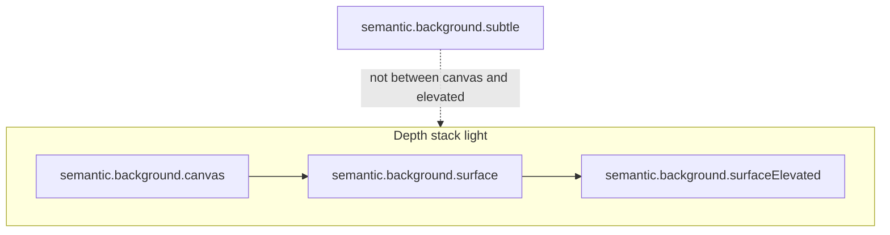

# Surface tokens — AI-readable reference

<!-- Token reference: background surfaces and stacking. AI-readable. Prefer semantic.background.* over primitives; see color-semantic.json, color-semantic-dark.json, policies/tokens-and-css.md. -->

---

## Meta

```yaml
document_type: token_reference
topic: background_surfaces
scope: layout_shell | cards | modals | depth
audience: ai_consumers | developers | designers
canonical_sources:
  - design-system/tokens/color-semantic.json
  - design-system/tokens/color-semantic.md (§3 Background)
  - design-system/tokens/color-semantic-dark.json
  - design-system/tokens/color-semantic-dark.md (§3 Background)
  - design-system/tokens/color-primitives.json
```

---

## 1. What surface tokens are

**Surface tokens** are the semantic **background roles** under `semantic.background.*`. They describe **where** UI sits in the visual stack: the full viewport, raised cards, floating layers, and low-emphasis fills. Reading the stack from **back to front** (largest, least elevated → smallest, most elevated) keeps depth predictable and theming consistent.

Use these tokens for `background-color` (or equivalent) on regions — not for text color. Pair each surface with **text** tokens from `semantic.text.*` per `color-semantic.md` contrast notes.

---

## 2. Stacking model (light theme)



- **canvas → surface → surfaceElevated** form the main **elevation ladder** for page → cards/panels → overlays.
- **subtle** is **not** a step between canvas and elevated in the ladder. Use it for **inputs at rest**, disabled chrome, inset strips, and other **low-emphasis** areas (see §4).

---

## 3. Role table — light theme

Values are **primitive references** from [`color-semantic.json`](color-semantic.json). Resolve hex in [`color-primitives.json`](color-primitives.json) when auditing contrast.

| Semantic token | Primitive reference | When to use | Text pairing | Border / edge notes |
|----------------|---------------------|-------------|--------------|---------------------|
| `semantic.background.canvas` | `primitive.common.white` | Page or app **root** background; full-bleed shell behind main layout. | `semantic.text.primary`, `semantic.text.secondary` | — |
| `semantic.background.surface` | `primitive.gray.50` | **Cards, panels**, sidebars, tables on canvas — one step “above” the root. | `semantic.text.primary` on surface (≥4.5:1) | Optional 1px border from `primitive.gray.200` for card edge (≥3:1 UI) per product. |
| `semantic.background.surfaceElevated` | `primitive.common.white` | **Modals, dropdowns, popovers**, date-picker panels — floats above surface/canvas. | Same as canvas-level text rules on white | Prefer border from `primitive.gray.200` for ≥3:1 separation from what is behind (`color-semantic.md` §3). |
| `semantic.background.subtle` | `primitive.gray.100` | **Disabled** regions, subtle sections, empty input backgrounds (see `components/input.md`). | `primitive.gray.700` or darker for body text (≥4.5:1) | Do not assume long copy on subtle without checking contrast. |

**Guidance (same as `color-semantic.md`):** Prefer **canvas → surface → surfaceElevated** when stacking. Avoid long **primary** body text on `subtle` unless type size/weight and contrast are verified.

---

## 4. Role table — dark theme

Same **semantic paths** and **same CSS variable names** as light; values come from [`color-semantic-dark.json`](color-semantic-dark.json). Full tables: [`color-semantic-dark.md`](color-semantic-dark.md) §3.

| Semantic token | Primitive reference (dark) | When to use |
|----------------|----------------------------|-------------|
| `semantic.background.canvas` | `primitive.gray.900` | Dark page root. |
| `semantic.background.surface` | `primitive.gray.800` | Dark cards, panels — stepped above canvas. |
| `semantic.background.surfaceElevated` | `primitive.gray.700` | Dark modals, popovers, dropdowns. |
| `semantic.background.subtle` | `primitive.zinc.800` | Dark disabled / subtle sections. |

Pair with **`semantic.text.primary`** (`gray.50`) and **`semantic.text.secondary`** (`gray.400`) on dark surfaces per `color-semantic-dark.md`.

---

## 5. Typical CSS custom properties

This repository does not ship a global `variables.css`; **apps** should alias semantic roles to stable names. Component specs often use the following pattern:

| Semantic role | Typical CSS variable | Maps from |
|---------------|----------------------|-----------|
| Canvas | `--color-bg-canvas` | `semantic.background.canvas` |
| Surface (card/panel) | `--color-bg-surface` | `semantic.background.surface` |
| Elevated (modal/popover) | `--color-bg-surface-elevated` or `--color-bg-canvas` when same as canvas in light | `semantic.background.surfaceElevated` |
| Subtle | `--color-bg-subtle` | `semantic.background.subtle` |

**Gap:** There is no single repo-wide file that defines these aliases; implementations must map from `color-semantic.json` / `color-semantic-dark.json` at build time or theme layer.

---

## 6. Examples for agents

- **Dashboard with a card grid:** `body` or app root `background: var(--color-bg-canvas)`; each **card** `background: var(--color-bg-surface)`; **modal** `background: var(--color-bg-surface-elevated)` (or theme equivalent) with border token for separation.
- **Settings page (single column):** Page `canvas`; optional **grouped sections** as `surface` cards on canvas; **inputs** use `subtle` / canvas per `input.md` for the control fill, not necessarily the whole page.
- **Modal over a dimmed page:** Overlay scrim uses a separate overlay token (often primitive black at opacity — not a `semantic.background.*` surface); **dialog panel** uses `surfaceElevated` + `aria` per `components/modal.md`.

---

## 7. Do’s and don’ts

- **Do** use `semantic.background.*` for region backgrounds so light/dark switches stay one set of variable names.
- **Do** verify **text** and **non-text** contrast (`color-semantic.md`, WCAG 2.2) when placing copy on `subtle` or colored strips.
- **Don’t** use raw **hex** or arbitrary grays for app shell backgrounds when a semantic role exists.
- **Don’t** mix up **canvas** and **surface** without checking JSON: they are **not** interchangeable in the current token file.

---

## 8. Gray page and white cards (common product pattern)

Many products use a **light gray page** (e.g. close to `#FAFAFA`, similar to `primitive.zinc.50` in [`color-primitives.json`](color-primitives.json)) with **white** **cards** on top.

**Current canonical mapping in `color-semantic.json` (light) is different:**

- **Canvas** is **white** (`primitive.common.white`).
- **Surface** (cards/panels) is **`primitive.gray.50`** (#F9FAFB per primitives file) — a **very light gray**, not white.

So today’s tokens describe **white app root** and **slightly gray cards**, not gray root and white cards. To match **gray page + white cards** literally while keeping semantic naming honest, you would **change** `color-semantic.json` (and §3 in `color-semantic.md`) — for example map `canvas` → a light gray primitive and `surface` → `common.white` — then re-run contrast documentation. That is a **design-system change**, not implied by this document alone.

Until then, treat **`color-semantic.json`** as source of truth and use this file for **how to stack** the roles.

---

## 9. Related documents

| File | When to read |
|------|----------------|
| [`color-semantic.md`](color-semantic.md) | Full semantic color tables, contrast notes |
| [`color-semantic-dark.md`](color-semantic-dark.md) | Dark theme surfaces and theme switching |
| [`components/card.md`](../components/card.md) | Card component on `surface` |
| [`components/modal.md`](../components/modal.md) | Elevated surfaces and overlays |
| [`components/input.md`](../components/input.md) | `subtle` / canvas for controls |

---

*Reference version: 1.0 — Aligns with `color-semantic.json` / `color-semantic-dark.json` as of authoring; update if primitives or semantic references change.*
